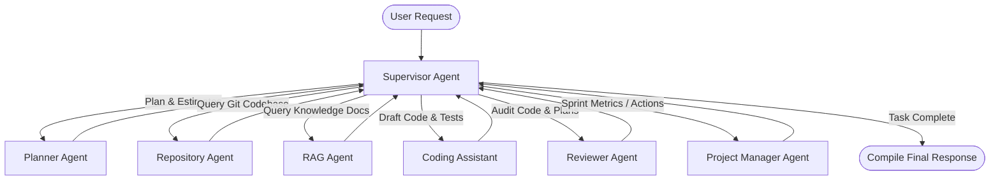

# DevPilot AI – AI Engineering Project Manager MVP

DevPilot AI is a production-quality engineering project manager co-pilot. Instead of functioning as a simple Jira replacement, it leverages a **LangGraph multi-agent workflow** to perform repository search, source-code analysis, document-based RAG, task planning, code recommendations, automated testing checklists, meeting transcripts action-item parsing, and sprint summaries recommendations.

---

## Architecture Overview

### LangGraph Multi-Agent Collaboration Workflow
The AI orchestration is structured as a hub-and-spoke model. The **Supervisor Agent** evaluates incoming prompts, checks context, and routes control flow.



1. **Supervisor Agent**: The gatekeeper. Evaluates inputs and histories to determine routing target or completes iteration (`FINISH`).
2. **Planner Agent**: Generates task summaries, technology stacks, difficulty ratings, folder architectures, and step-by-step roadmap guides.
3. **Repository Agent**: Performs similarity searches on code chunks stored in the vector database and identifies implementation points.
4. **RAG Agent**: Retrieves context from uploaded manuals, technical specifications, and general files (PDF, DOCX, TXT, MD).
5. **Coding Assistant**: Generates Python, JS, or framework templates, unit tests, and structural updates.
6. **Reviewer Agent**: Checks proposed plans/code scripts for security, design patterns, and bugs.
7. **Project Manager Agent**: Automates action item generation from transcripts, schedules backlog tasks, and estimates sprint risk metrics.

---

## Folder Structure

```text
aiagentprac/
├── backend/
│   ├── app/
│   │   ├── agents/
│   │   │   ├── agent_definitions.py    # Multi-agent definitions & LLM selection
│   │   │   └── graph_state.py          # State dictionary schema
│   │   ├── api/
│   │   │   └── endpoints.py            # REST routers
│   │   ├── config/
│   │   │   └── settings.py             # Settings configurations via Pydantic
│   │   ├── db/
│   │   │   ├── models.py               # SQLAlchemy schemas
│   │   │   └── session.py              # DB Pool session makers
│   │   ├── graph/
│   │   │   └── workflow.py             # LangGraph stategraph compilation
│   │   ├── rag/
│   │   │   └── vector_store.py         # RAG chunking & Pgvector/SQLite similarity
│   │   ├── schemas/
│   │   │   └── schemas.py              # Pydantic validation schemas
│   │   ├── utils/
│   │   │   ├── doc_loader.py           # file extraction (pdf, docx, md, txt)
│   │   │   └── git_indexer.py          # Git repository scanner
│   │   └── main.py                     # Uvicorn entrypoint
│   └── pyproject.toml                  # Python dependency configuration
├── frontend/
│   └── app.py                          # Streamlit application UI
├── .env.example                        # Key placeholders
├── db_schema.sql                       # Postgres Supabase schema
├── verify_setup.py                     # Self-checking verification test
└── README.md                           # Documentation
```

---

## Setup & Local Installation

### Prerequisites
- Python 3.12+
- `uv` installed (`pip install uv` or `powershell -c "irm https://astral.sh/uv/install.ps1 | iex"`)
- Git

### 1. Configure Keys
Duplicate the environment template and name it `.env`:
```bash
cp .env.example .env
```
Fill out at least one LLM API key:
- `GOOGLE_API_KEY` (Gemini model defaults to `gemini-2.5-flash`)
- `OPENAI_API_KEY` (OpenAI model defaults to `gpt-4o-mini`)

*Note: If no API keys are supplied, the backend falls back to a deterministic simulated mock engine. This enables verification and testing of the MVP without external credentials.*

### 2. Verify Setup
Run the automated validation script using `uv`:
```bash
uv run verify_setup.py
```
This script confirms:
- Python environment load.
- SQLAlchemy database connection and table layout.
- LangGraph graph compilation.
- REST router mock runs.

---

## How to Run Locally

### Start Backend REST APIs
From the root workspace folder:
```bash
uv run uvicorn backend.app.main:app --host 0.0.0.0 --port 8000 --reload
```
API Documentation will be live at:
- Swagger Docs: http://localhost:8000/docs
- ReDoc: http://localhost:8000/redoc

### Start Streamlit Frontend
In a new terminal shell:
```bash
uv run streamlit run frontend/app.py --server.port 8501
```
The User Interface will open at http://localhost:8501.

---

## How LangGraph and RAG Work

### How LangGraph Works
The workflow compiles the agent connections in `backend/app/graph/workflow.py`. The state holds `messages`, `agent_visited` list, `repo_context`, `kb_context`, `plan`, and `suggestions`. Each node represents a function that manipulates state.
Once a node finishes, control goes back to `supervisor`, which routes either to the next specialized node or stops (`END`).

### How RAG Works
- **Ingestion**: Documents are parsed (`doc_loader.py`), split into overlapping chunks, embedded, and saved in the `documents` table.
- **Git Ingestion**: Source code directories are crawled (`git_indexer.py`), filtered by extension, chunked, and saved in the `documents` table.
- **Search**: During query times, the system computes the query's vector embedding, performs a pgvector cosine similarity index query in Postgres (or NumPy similarity fallback on SQLite), and presents the top matches as context inside the Prompt.

---

## How to Add New Agents

Adding a new agent is simple and modular:
1. **Define State Fields**: If the agent needs specific state fields, add them to `AgentState` in `backend/app/agents/graph_state.py`.
2. **Define Agent Node**: Create a node function in `backend/app/agents/agent_definitions.py`. It should accept `AgentState` and return updates:
   ```python
   def devops_agent(state: AgentState) -> dict:
       # Run logic / LLM query
       return {"suggestions": "devops recommendations", "agent_visited": state["agent_visited"] + ["DevOps"]}
   ```
3. **Register Node & Routes**: Edit `backend/app/graph/workflow.py`:
   - Register node: `workflow.add_node("devops", devops_agent)`
   - Add routes from supervisor:
     ```python
     workflow.add_conditional_edges("supervisor", ..., {..., "DEVOPS": "devops"})
     ```
   - Connect edge back: `workflow.add_edge("devops", "supervisor")`
4. **Update Supervisor Instructions**: Update the prompt in `supervisor_agent` (in `backend/app/agents/agent_definitions.py`) instructing it when to route to `DEVOPS`.

---

## API Documentation

### Projects
- `GET /api/projects` - List all projects.
- `POST /api/projects` - Create a project.

### Tasks
- `GET /api/tasks?project_id={id}` - List all tasks.
- `POST /api/tasks` - Create a task. **Generates AI analysis automatically**.
- `PUT /api/tasks/{task_id}` - Update a task status/priority.
- `DELETE /api/tasks/{task_id}` - Delete a task.

### Repository
- `POST /api/repository/index` - Clone/Scan Git repository (runs in background task).
- `GET /api/repository/query` - Semantic code search.

### Knowledge Base
- `POST /api/kb/upload` - Upload PDF, Docx, MD, TXT for RAG.

### Chat
- `POST /api/chat` - Start conversation with multi-agent LangGraph workflow.

### Sprints & Meetings
- `POST /api/meetings` - Extract action items and suggested tasks.
- `POST /api/sprint/report` - Formulate sprint summary and recommendations.

---

## Deployment Guide

### Database (Supabase)
1. Register on [Supabase](https://supabase.com/).
2. Create a new PostgreSQL Database.
3. Open the SQL Editor, copy and run the contents of [db_schema.sql](file:///d:/Website/aiagentprac/db_schema.sql) to set up tables.
4. Copy the connection string under DB Settings.
5. In your production `.env`, set `DATABASE_URL` to your Supabase PostgreSQL connection URI.

### Backend Hosting (Render / Docker)
Add a standard Dockerfile to backend:
```dockerfile
FROM python:3.12-slim
COPY --from=ghcr.io/astral-sh/uv:latest /uv /bin/
WORKDIR /app
COPY backend/ /app/
RUN uv sync --no-dev
EXPOSE 8000
CMD ["uv", "run", "uvicorn", "app.main:app", "--host", "0.0.0.0", "--port", "8000"]
```

### Frontend Hosting (Streamlit Cloud)
Connect your GitHub repository to Streamlit Cloud, configure Environment Variables in the UI Settings panel pointing `API_URL` to your deployed backend URL, and set the entrypoint path to `frontend/app.py`.
